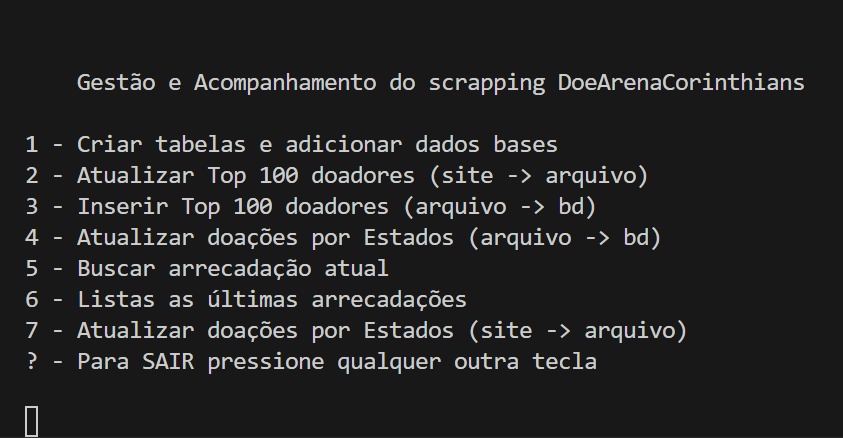

# _Módulo de Persistência de Dados para Arrecadação_


---

## Sumário

- [Histórico de Versão](#histórico-de-versão)
- [Introdução](#introdução)
   - [Contexto da Campanha de Arrecadação para quitação da Arena Corinthians](#contexto-da-campanha-de-arrecadação-para-quitação-da-arena-corinthians)
- [Estrutura do Projeto](#estrutura-do-projeto)
- [Funcionalidades](#funcionalidades)
- [Bibliotecas Utilizadas](#bibliotecas-utilizadas)
- [Extra - Extensão Visual Studio Code](#extra---extensão-visual-studio-code)
- [Ambiente Virtual - Windows](#ambiente-virtual---windows)
   - [Requirements](#requirements)
- [Menu](#menu)
- [Links de Estudo](#links-de-estudo)
- [Próximas evoluções](#próximas-evoluções)

---

## Histórico de Versão

| Versão | Data       | Autor               | Descrição         |
|--------|------------|---------------------|-------------------|
| 1.0.0  | 07/03/2025 | [Adenilton Ribeiro](http://github.com/adeniltonr), [Gregorio Queiroz](https://github.com/GregMasterBr) | Início do Projeto |
| 1.0.1  | 19/03/2025 | [Adenilton Ribeiro](http://github.com/adeniltonr), [Gregorio Queiroz](https://github.com/GregMasterBr) | Testes de Scrapping|
| 1.0.2  | 21/03/2025 | [Adenilton Ribeiro](http://github.com/adeniltonr), [Gregorio Queiroz](https://github.com/GregMasterBr) | Modularização e funções complementares |
| 1.0.3  | 21/03/2025 | [Adenilton Ribeiro](http://github.com/adeniltonr), [Gregorio Queiroz](https://github.com/GregMasterBr) | Criação do Readme |

---

## Introdução

Este projeto implementa um módulo de persistência de dados para armazenar informações coletadas do site de arrecadação (vaquinha) da Arena Corinthians. Ele recebe dados extraídos por scripts de **web scraping** e os salva em um banco de dados estruturado, permitindo consultas e futuras análises, como processamento de linguagem natural (NLP) para análise de sentimentos e previsão de tendências.

O banco de dados utilizado é o **SQLite**, e as informações podem ser visualizadas com o **DBeaver**. Para o web scraping, foi utilizado o **Selenium** com o driver do Firefox (**geckodriver**).

### Contexto da Campanha de Arrecadação para quitação da Arena Corinthians

A construção da Arena Corinthians iniciou-se em 30 de maio de 2011 e, após três anos de obras, ela foi inaugurada em 10 de maio de 2014, com a realização de um jogo marcante envolvendo a participação de mais de 100 ex-jogadores que passaram pelo clube. O estádio foi utilizado para jogos da Copa do Mundo daquele ano. 
O primeiro jogo oficial do Corinthians na nova casa ocorreu em 18 de maio de 2014 contra o Figueirense.

A iniciativa de arrecadação partiu de uma das maiores torcidas organizadas do corinthians, a Gaviões da Fiel, com a missão de quitar/diminuir a dívida do clube com o financiamento da caixa, na ordem de 710 milhões, divulgada pelo clube em 13 de setembro de 2024. 

>A Fiel Torcida sempre esteve presente em momentos importantes na história do Corinthians dentro e fora de campo. Nós acreditamos que, ao contribuirmos com a quitação da dívida com a Caixa, o clube ganha mais saúde financeira para gerir o estádio e resolver os demais desafios de gestão que enfrenta atualmente (Gaviões da Fiel). 

O valor doado pelos torcedores é depositado em uma conta <abbr title="É conta-caução ou conta de garantia. É uma ferramenta bancária que funciona como uma garantia em acordos comerciais.">escrow</abbr> da Caixa e só poderá ser movimentada após o encerramento da campanha para abatimento/quitação da dívida da Arena Corinthians.

Todos os doadores receberão um certificado de participação. Além disso, participação de sorteios semanais de ingressos entre os doadores para os jogos realizados na Arena Corinthians até o fim da campanha. Os torcedores que acumularem R$ 100 em doações, terão o nome eternizado em um mural físico que será construído na Arena Corinthians após a realização da campanha.

Conheça mais da iniciativa através do site <[https://www.doearenacorinthians.com.br/](https://www.doearenacorinthians.com.br/)>

## Estrutura do Projeto

Aqui está uma visão geral da estrutura básica do projeto:

DOEARENACORINTHIANS/

├── README.md

├── main.py

├── bd.py

├── buscar_arrecadacao_atual.py

├── copiar_conteudo_html_top_100_doadores.py

├── extrair_dados_mapa_doacao_por_estados.py

├── extrair_dados_top100_doadores.py

├── dados/

│ ├── dados_estados.json

│ ├── arrecadacoes_estados.txt

│ ├── conteudo_para_extracao_top100doadores.txt

│ └── resultado_top_100_doadores.txt

└── arenacorinthinas.db

- **`README.md`**: Este arquivo contém as motivações, instruções e direcionamento para que o projeto possa ser compreendido e utilizado.
- **`main.py`**: O arquivo principal do projeto, que contém o menu de funcionalidades.
- **`bd.py`**: Módulo responsável pela criação e manipulação do banco de dados.
- **`buscar_arrecadacao_atual.py`**: Script para buscar a arrecadação atual do site.
- **`copiar_conteudo_html_top_100_doadores.py`**: Script para copiar o conteúdo HTML dos top 100 doadores.
- **`extrair_dados_mapa_doacao_por_estados.py`**: Script para extrair dados de doações por estados.
- **`extrair_dados_top100_doadores.py`**: Script para extrair os dados dos top 100 doadores.
- **`dados/`**: Pasta que contém os arquivos de dados utilizados pelo projeto.
- **`arenacorinthinas.db`**: Banco de dados SQLite gerado pelo projeto.

## Funcionalidades

O projeto oferece as seguintes funcionalidades:

1. **Criar tabelas e adicionar dados bases**: Cria as tabelas no banco de dados e insere os dados iniciais, como os estados e os top 100 doadores.
2. **Atualizar Top 100 doadores (site -> arquivo)**: Coleta os dados dos top 100 doadores do site e salva em um arquivo.
3. **Inserir Top 100 doadores (arquivo -> bd)**: Insere os dados dos top 100 doadores no banco de dados.
4. **Atualizar doações por Estados (site -> bd)**: Atualiza as doações por estados no banco de dados com base nos dados coletados do site.
5. **Buscar arrecadação atual**: Busca a arrecadação atual do site e a insere no banco de dados.
6. **Listar as últimas arrecadações**: Exibe as últimas arrecadações registradas no banco de dados.
7. **Coletar doações por estados (site -< arquivo>)**: Visita o site e coleta todas as atualizações recentes de doações de cada estado e salva em um arquivo chamado arrecadacoes_estados.txt.

## Bibliotecas Utilizadas

- **`re`**: Para manipulação de expressões regulares.
- **`selenium`**: Para automação de navegador e web scraping.
- **`time`**: Para controle de tempo e pausas.
- **`sqlite3`**: Para manipulação do banco de dados SQLite.
- **`json`**: Para manipulação de arquivos JSON.
- **`datetime`**: Para manipulação de datas e horas.
- **`ast`**: Para manipulação de árvores sintáticas abstratas.

## Extra - Extensão Visual Studio Code

- [**SQLite Viewer**](https://marketplace.visualstudio.com/items?itemName=qwtel.sqlite-viewer): Para visualizar o conteúdo do banco diretamente pela IDE do VSC.

## Ambiente Virtual - Windows

Para criar um ambiente virtual com o python , siga os passos abaixo:

1. **Crie um Ambiente Virtual**: Abra um terminal e execute o seguinte comando para criar um ambiente virtual com um nome específico (substitua `nome_do_seu_ambiente` pelo nome desejado):

   ```bash
   python -m venv name nome_do_seu_ambiente
   ```
   
2. **Ative o Ambiente Virtual**: Abra o terminal, na raiz do projeto, e execute o seguinte comando para criar um ambiente virtual com um nome específico (substitua `nome_do_seu_ambiente` pelo nome desejado):

   ```bash
   nome_do_seu_ambiente\Scripts\activate
   ```
### Requirements

1. **Instale as dependências do projeto**: No terminal, na raiz do projeto, execute o seguinte comando para instalar todas as dependências do projeto no ambiente virtual ativado:

   ```bash
   pip install -r requirements.txt
   ```

2. **Executando o código**: Com o termainal abeto execute:

   ```bash
   python .\main.py
   ```

## Menu



## Links de Estudo

- [Documentação do Selenium](https://www.selenium.dev/documentation/)
- [Documentação do SQLite](https://www.sqlite.org/docs.html)
- [Geckodriver Releases](https://github.com/mozilla/geckodriver/releases)
- [DBeaver - Visualização de Banco de Dados](https://dbeaver.io/)

## Próximas evoluções

- Criar rotinas (cron/agendamento) para que a coleta de scrapping aconteça baseado em critérios temporais;
- Adicionar estatísticas;
- Parametrizar a quantidade de arrecações que o usuário deseja consultar;
- Adicionar um frontend para visualização;
- Analisar e adicionar novas tabelas e informações para serem coletadas.
