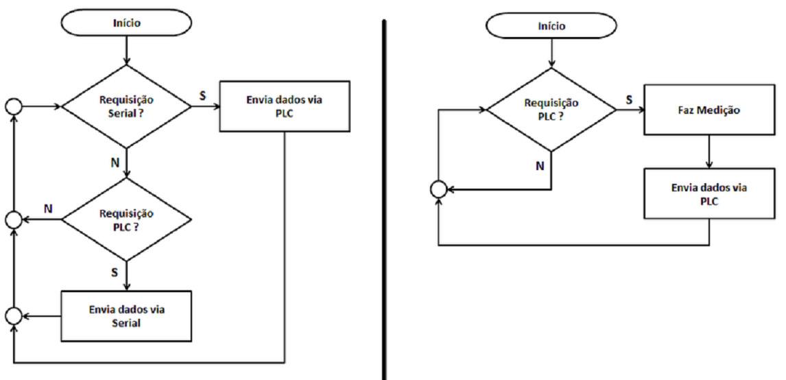

# _Aplicação_


---

## Sumário

- [Histórico de Versão](#histórico-de-versão)
- [Introdução](#introdução)
- [Estrutura do Projeto](#estrutura-do-projeto)
- [Links de Estudo](#links-de-estudo)
- [Fluxograma](#fluxograma)
- [Ambiente Virtual](#ambiente-virtual)

## Histórico de Versão

| Versão | Data       | Autor               | Descrição         |
|--------|------------|---------------------|-------------------|
| 1.0.0  | 07/03/2025 | Adenilton, Gregorio | Início do Projeto |

## Introdução

Este é um projeto Python incrível que faz [descrição curta do projeto].

## Estrutura do Projeto

Aqui está uma visão geral da estrutura básica do projeto:

meu_projeto/

├── README.md

├── main.py

├── src/

│ ├── módulo1.py

│ ├── módulo2.py

│ └── ...

├── data/

│ ├── arquivo1.csv

│ ├── arquivo2.json

│ └── ...

└── ...


- `README.md`: Este arquivo que você está lendo agora.
- `main.py`: O arquivo principal do projeto.
- `src/`: Uma pasta que contém os módulos do projeto.
- `data/`: Uma pasta que contém dados ou recursos utilizados pelo projeto.

## Links de Estudo

__[Documentação Firebase](https://github.com/mobizt/Firebase-ESP32)__

__[Documentação dos pinos ESP32](https://randomnerdtutorials.com/esp32-pinout-reference-gpios/)__

__[Datasheet ESP32](https://www.espressif.com/sites/default/files/documentation/esp32_datasheet_en.pdf)__

## Fluxograma



## Ambiente Virtual

Para criar um ambiente virtual com o Anaconda, siga os passos abaixo:

* __Instale o Anaconda:__ Se você ainda não tem o Anaconda instalado, siga as instruções de instalação no site oficial do Anaconda.

* __Crie um Ambiente Virtual:__ Abra um terminal e execute o seguinte comando para criar um ambiente virtual com um nome específico (substitua nome_do_seu_ambiente pelo nome desejado):

```
conda create --name nome_do_seu_ambiente python=3.x
```

Isso criará um ambiente virtual com a versão específica do Python.

* __Ative o Ambiente Virtual:__ Para ativar o ambiente virtual, execute:

```
conda activate nome_do_seu_ambiente
```

  Você verá o nome do ambiente virtual aparecer no prompt do terminal.

* __Desativar o Ambiente Virtual:__ Para desativar o ambiente virtual, execute:

Isso o retornará ao ambiente base.

Agora você tem um ambiente virtual configurado com o Anaconda para o seu projeto Python.


Lembre-se de personalizar todas as seções, incluindo o nome do projeto, links de estudo e a estrutura do projeto, de acordo com as necessidades do seu projeto específico.
